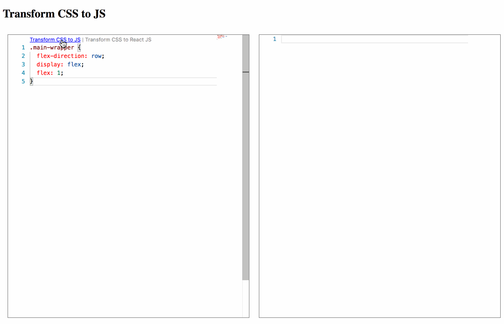

# Transform Language Server

The transform language server providing code transformations, like CSS to JS, JSON to TypeScript/Flow and so on.

Transformations are based on [transform-it](https://github.com/transform-it/transform-www).

The [language server protocol](https://github.com/Microsoft/language-server-protocol) is an interface between tools and language services. The language service implementing this protocol can be used by tools and editors supporting it, like [VS code](https://code.visualstudio.com/), [Atom](https://atom.io/packages/atom-languageclient), [Monaco](https://www.npmjs.com/package/monaco-languageclient) or [Theia](https://github.com/theia-ide/theia).

See the full list of supporting tools [here](https://github.com/Microsoft/language-server-protocol/wiki/Protocol-Implementations#editors-ides-supporting-the-protocol).

## Getting Started

### Clone and build transform-languageserver

    git clone https://github.com/transform-it/transform-languageserver.git
    npm install

### Run the Monaco example

    cd example
    npm install
    npm run start

Go to the browser and open `http://localhost:3000` to try out the example.

## License

[MIT](LICENSE)
